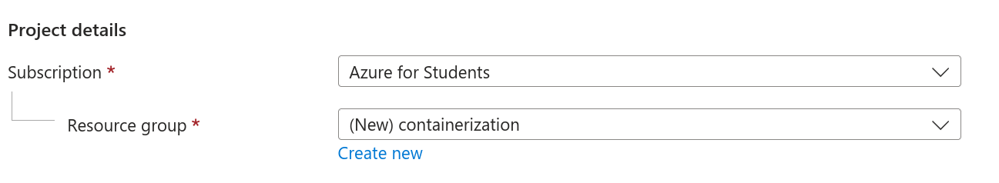
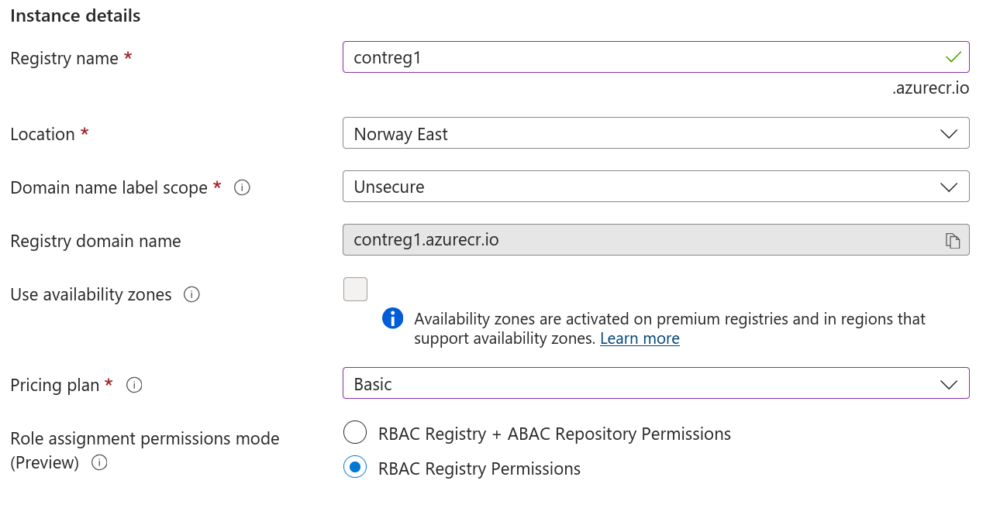
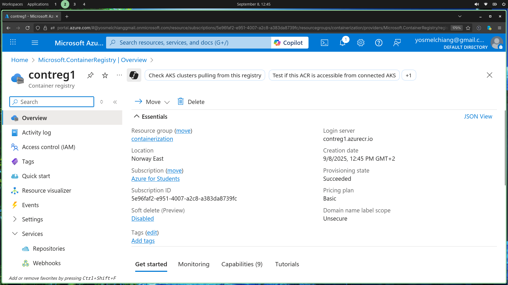

# About
We are going to create a container registry using the `Azure Portal`. For quick reference see [Docs](https://learn.microsoft.com/en-us/azure/container-registry/container-registry-get-started-portal?tabs=azure-cli)

# Steps

## Project Details
My current subscription is set by default to `Azure for Students`

We need to assign this registry to a `resource group`, we create a new one and name it `containerization`.

## Instance details
We are going to leave most the settings here as default and only change `name`, `location` and `pricing plan`.

## Deployment
