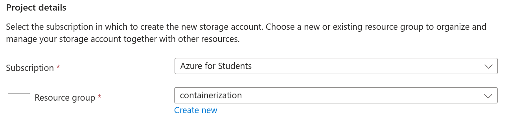
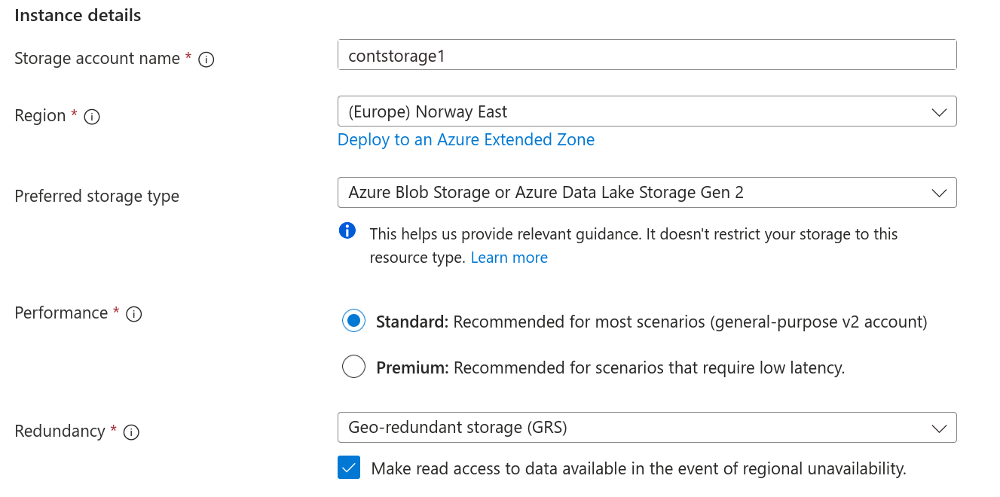
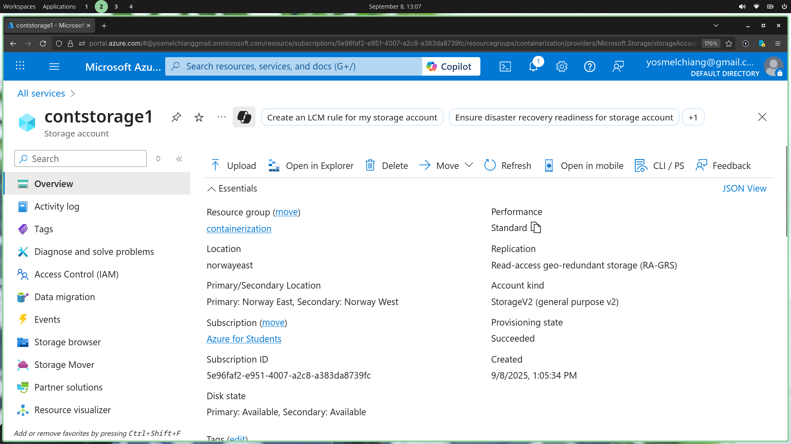

# About
Now that we have a registry, we can simply build images and push to it using the `Azure Cloudshell`.

For this project, we are not going to use the cloudshell, we are doing it on a local machine instead, but for the sake of documenting the process, here is how we would go forward. For quick ref, see [Docs](https://learn.microsoft.com/en-us/azure/cloud-shell/get-started/existing-storage?tabs=azurecli)

# Creating a storage account
Lets create a new storage account, we can find this service from `Storage` > `Storage Account`

- We choose a resource group, the one we created earlier will suffice.
- Give it a name: `contstorage1`
- Use standard blob storage.

## Deployment
