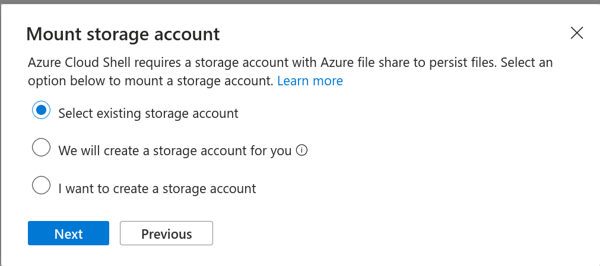
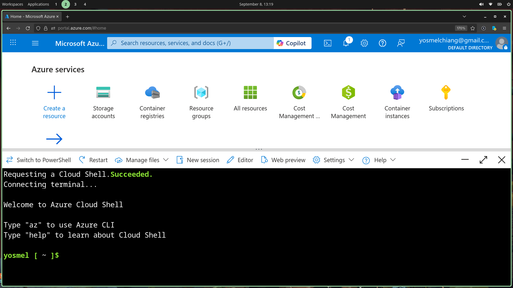

Now that we created a storage account, lets mount it up on our cloudshell. This will provide is with persistant storage for the filesystem used inside the cloudshell.

# Mount
On the next screen, we use choose existing storage account

# Select storage account
Select the storage account and resource group, for this one it is still `containerization` as resource group, and the new storage account named `contreg1`.

# Create a file share
We will be asked to provide a `File Share`, this refers to `Azure Files` which is a service that lets us store and share files within the `Azure` cloud ecosystem. Its just like a network drive, but hosted on Microsoft servers. Check the [DOCS](https://learn.microsoft.com/en-us/azure/storage/files/storage-files-introduction) for more.

# Create a file share
Chances are, that we dont have a file share in place already, so lets create one. Microsoft will provide us with a 5GB network image that we can use out of the bat.

# Deployment
If everything is successful, we should be gifted with a cloudshell.

