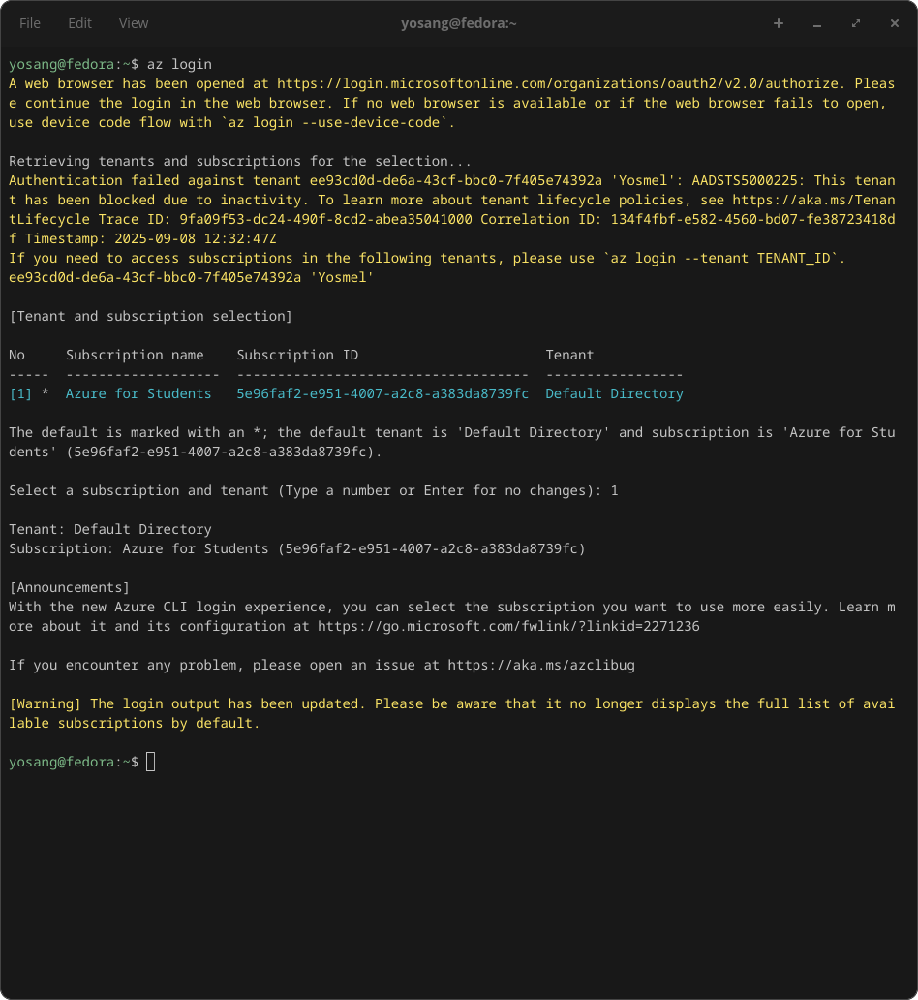

# About
There are two methods I know of for authenticating docker with our azure registry.

Needless to say, both methods require the Docker engine to be installed on our local machine for this to work.

# Method 1: Docker login
Out of the box, docker offers a login method that allows us to authenticate a registry. We can read the manpages for it using `man docker login`. The syntax is as follows: 
- `docker login [SERVER] -u [USERNAME] -p [PASSWORD]` - For the server we would use `contreg1.azurecr.io` in our case.

# Method 2: Azure CLI
The Azure CLI has its own authentication method for Container Registries, we only need to login with az first using `az login` which fires up a browser for authentication. Once we have logged in with azure we can login to the registry by using `az acr login --name [Registry_Name]`

# Final
For the sake of simplicity, Im going to use the last method, because it does not involve extra credentials.

## az login

### Confirm browser auth

### Choose subscription ID

## az acr login
This will create a new entry in `~/.docker/config.json` with Base64 encoded credentials, in order to clean this entry up after use (recommended) simply do `docker logout [registry_server]`

