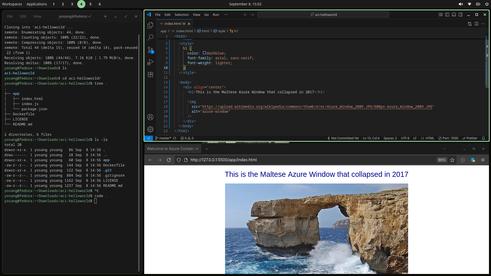
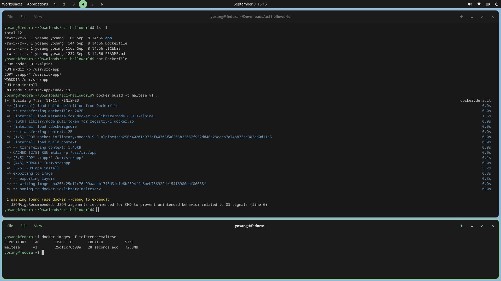
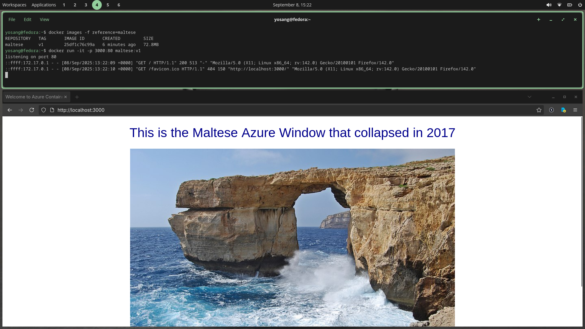

# Sample repo
We are starting off by pulling the application to local machine with `git clone` and inspect the contents.

# Change the content
We are doing some modifications to the `index.html` file using `VSCODE` such as changing the header text and the image

# Building the image
To build this image, we need to make sure we are in the root directory of the application. Then run `docker build -t maltese:v1 .`

The `-t` flag is short for tag, which uses the format `NAME:VERSION`, we are naming this image `maltese` and making it version `v1`.

The `.` specifies that the `Dockerfile` used for building this image is in the current directory.

# Checking the created image
Lets make sure our image is created properly using `docker images -f reference=maltese`, here the `-f` flag is short for filter and `reference` refers to the name of the image.

We can also see that the image we created runs as intended and we can access our application from localhost on the browser.

