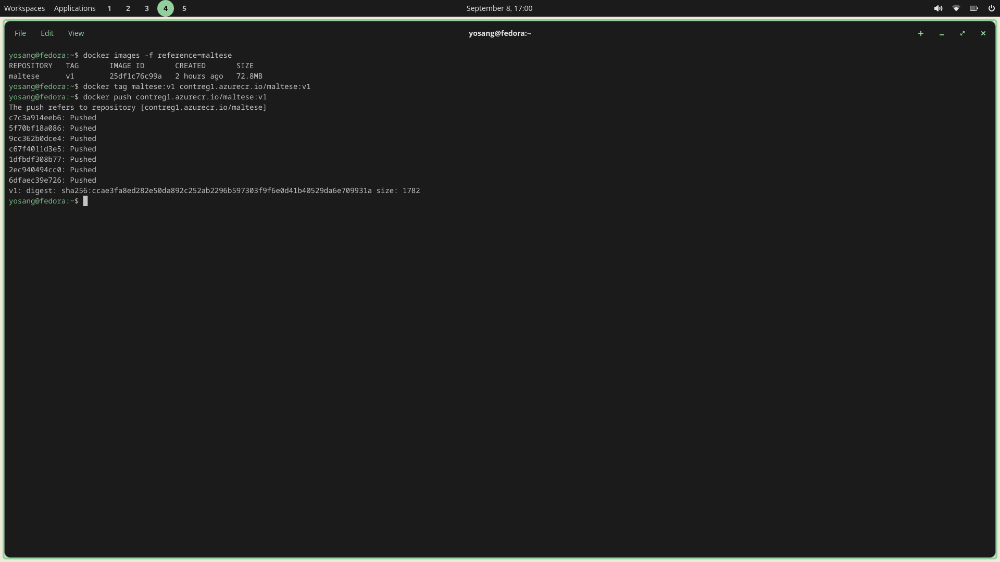
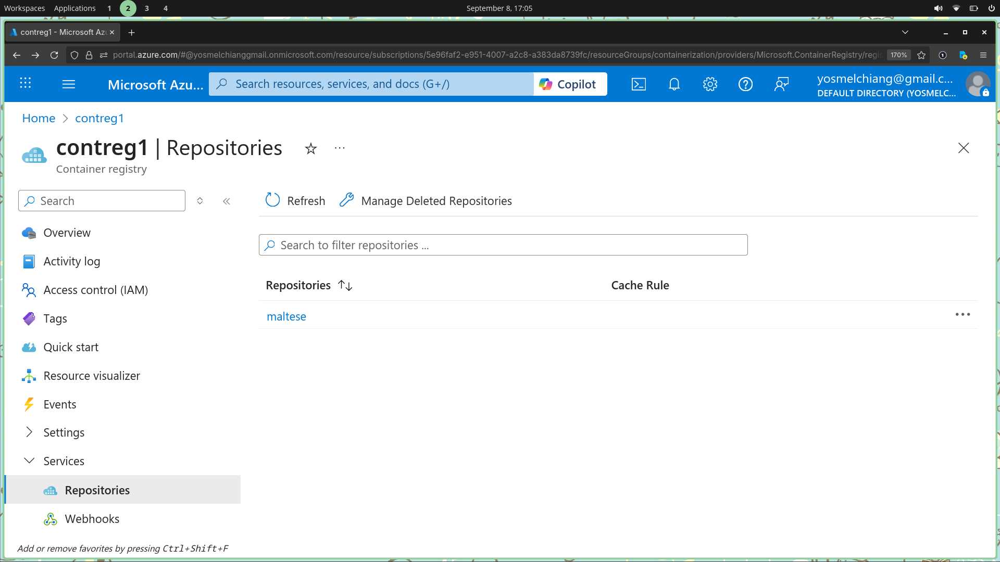

# Tag and push
In order to push the created image to azure registry we need to tag it first with `docker tag maltese:v1 contreg1.azurecr.io/maltese:v1`, once tagged we can push it with docker push `contreg.azurecr.io/maltese:v1`.

# Azure Portal
We can see in the `Azure Portal` that our new image is now available under `Container Registries` > `Services` > `Repositories`

