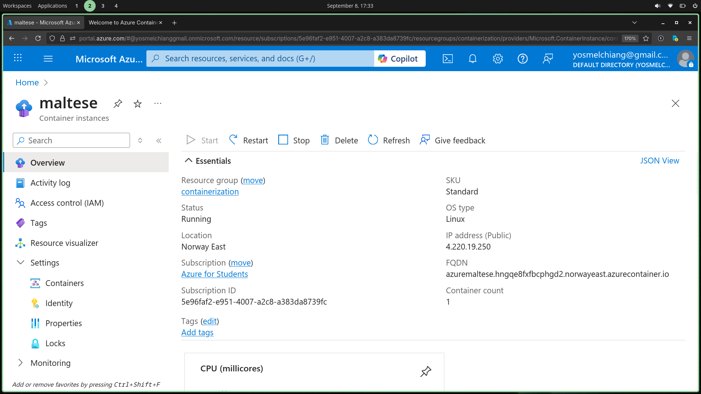
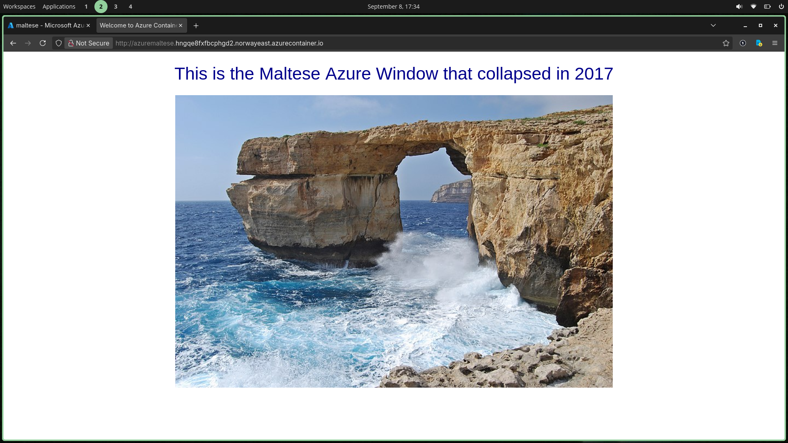

# About
With our new image available on the `Azure Container Registry`, we can now create a new instance and use it.

# Azure Portal
Container Instance can be found at `Services` > `Containers` > `Container Instance`.

Lets create one and choose the same resource group we've used before `containerization`.

# Instance details
We will name it to `maltese` and choose the existing registry: `contreg1`.

Everything else should be default.

# Networking
We will asign a `DNS` label to it: `azuremaltese`, and use a public network type.
Nothing to change here as the application is already listening on port `80`.

# Final
Submit the deployment:

Lets test it using the `FQDN` (Fully Qualified Domain Name)

