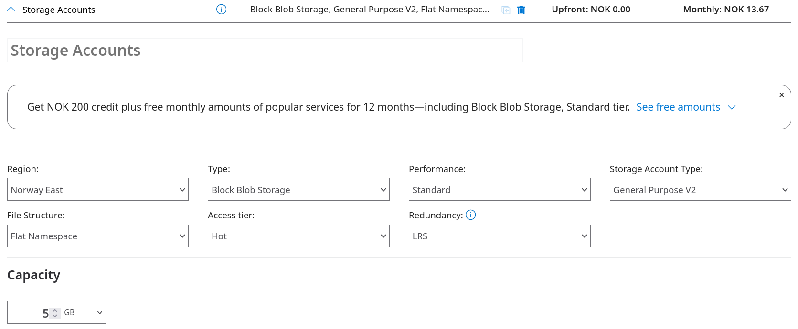
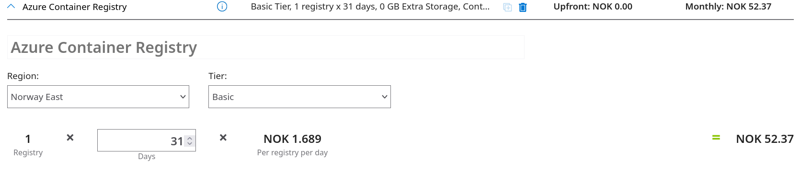
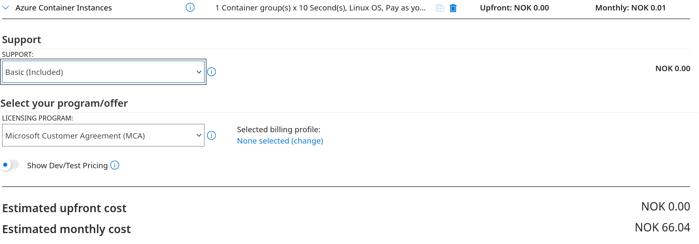
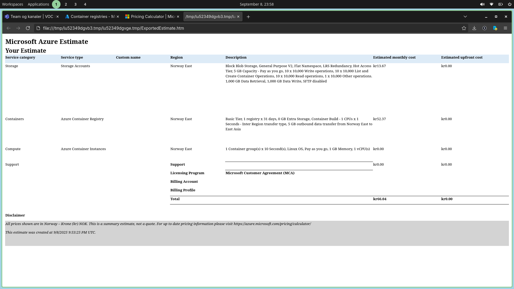

# Pricing Calculator
We are using Azure's pricing calculator to see what this solution might cost us.

https://azure.microsoft.com/en-us/pricing/calculator/

# Storage Account
Initially I created my storage account with `RA-GRS` - Geo-redundant storage, which is pricier. I set it `LRS` - Locally-redundant storage to keep it low costs. Redudancy means that data is copied to avoid loss of access in case of outages. To put it in perspective, with `LRS` if a node within a datacenter is out, data is still available for us. Howeever, if an entire data center is out, our data will not be avaiable for us. The higher tier of Redudancy, the higher availability in case of outages, we also got to pay more of course. Ref [Docs](https://learn.microsoft.com/en-us/azure/storage/common/storage-redundancy#durability-and-availability-by-outage-scenario)

- The monthly cost for this service lands at about `13.67 NOK`.

# Container Registry

The registry will cost about `52,37 NOK` monthly

# Container Instance

Running the instance itself costs under `1 NOK`, so its pretty low.

# Total
In total we would be paying around `66 NOK` for this solution. Just to have our container up and running on the cloud.

