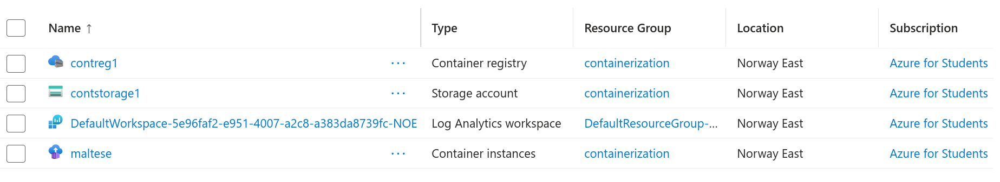

# Forecasting
Forecasting is a projection of the estimated costs for the set period. Its essential to have enough historical data to be able to forecast accurately.

For an anual forecast, at least 90 days of historical data is recommended.

In our case, I will leave my Container Instance running for a couple hours to gather some historical data and see if we can forecast the next quarter.
- [Ref 1](https://learn.microsoft.com/en-us/cloud-computing/finops/framework/quantify/forecasting)
- [Ref 2](https://learn.microsoft.com/en-us/azure/cost-management-billing/costs/cost-analysis-common-uses#view-forecast-costs.md)
- [Ref 3](https://learn.microsoft.com/en-us/azure/cost-management-billing/costs/quick-acm-cost-analysis#forecasting-costs-in-cost-analysis)

# Resources
Currently, these are the resources we got

# Cost Analysis
Lets navigate to `Services` > `General` > `Billing/Cost Management + Billing` > `Cost Management` > `Cost Analysis`

Here we fant to filter out old stuff and only show costs for the resources above.

